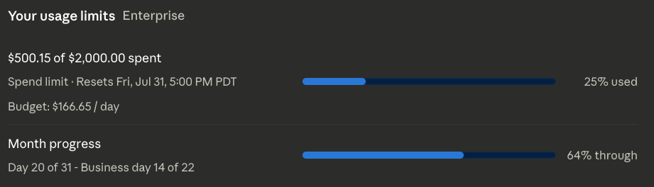

# claudeBudgetPacer

[Install](https://github.com/ad08fee3/userscripts/raw/refs/heads/main/userscripts/claudeBudgetPacer/claudeBudgetPacer.user.js)

Displays your spending progress relative to your billing month on [Claude's usage page](https://claude.ai/new#settings/usage).

This script adds two enhancements:

1. **Month Progress Bar** — A second progress bar showing what percentage of the current billing month has elapsed, so you can eyeball whether your spending is ahead or behind pace.

2. **Budget Per Day** — Shows the daily spending rate needed to exactly hit your limit by the month's end (e.g., "Budget: $62.30/day to hit limit"), helping you quickly assess if you're overspending or underspending relative to your pace.

This has only been tested to work with Claude Enterprise.
