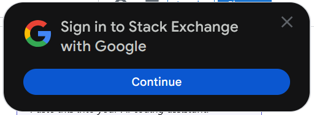

# hideSignInWithGoogle

[Install](https://github.com/ad08fee3/userscripts/raw/refs/heads/main/userscripts/hideSignInWithGoogle/hideSignInWithGoogle.user.js)

Closes the stupid _"sIgN iN wItH gOoGlE?"_ pop-up that happens on every site. 

_(Yes, I know you can turn this "feature" off in my Google account settings. I do have it disabled. It doesn't seem to matter, nor does it work in incognito windows when you aren't logged in.)_
